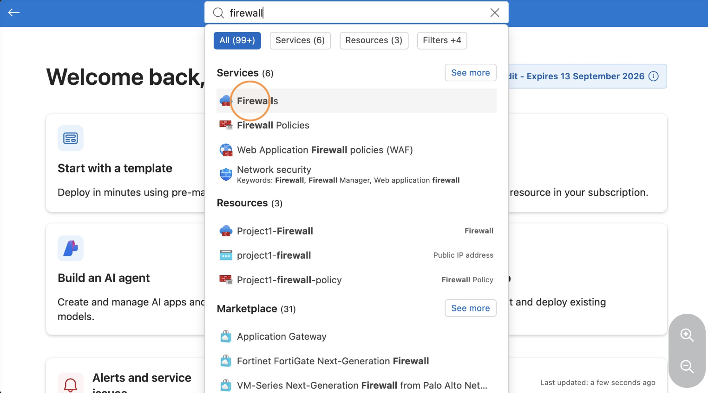

# STEP 6: Configure Azure Firewall

## Overview

This step covers configuring Azure Firewall with a DNAT rule to control and route inbound traffic to the web application running on the private virtual machine.

## Configuration

The following steps are performed:

1. Open the Azure Firewall configuration
2. Create a DNAT rule for the web application
3. Configure the firewall public IP as the inbound destination
4. Forward the allowed HTTP traffic to the private VM
5. Apply the firewall policy and rules
6. Test access to the web application through the Azure Firewall

## Screenshot

