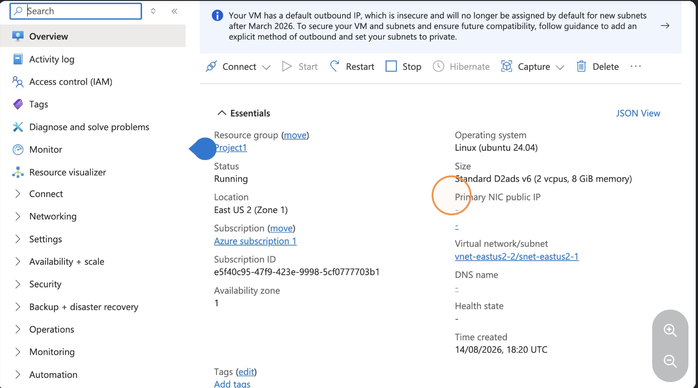

# STEP 3: Connect Using Azure Bastion

## Overview

This step covers connecting to the Azure virtual machine using Azure Bastion for secure administrative access without exposing the VM directly to the Internet.

## Configuration

The following steps are performed:

1. Open the Azure Bastion connection interface
2. Select the virtual machine
3. Authenticate and establish a secure Bastion session
4. Access and manage the virtual machine through the Bastion connection

## Screenshot

