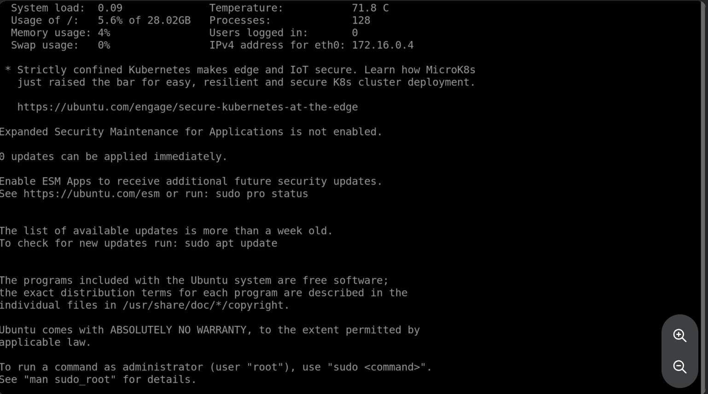

# STEP 4: Install Nginx in the Virtual Machine

## Overview

This step covers installing and configuring Nginx on the Ubuntu virtual machine.

Nginx is used as the web server to host and serve the web application.

## Configuration

The following steps are performed:

1. Connect to the virtual machine through Azure Bastion
2. Install the Nginx package
3. Start and enable the Nginx service
4. Verify that Nginx is running correctly

## Screenshot

